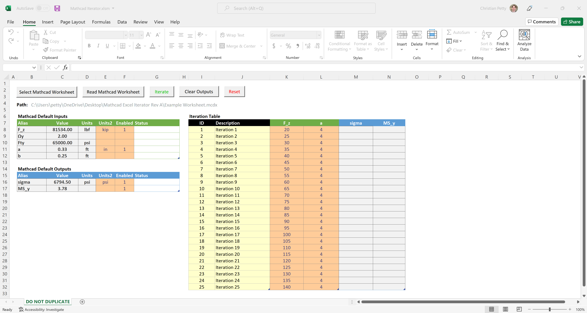
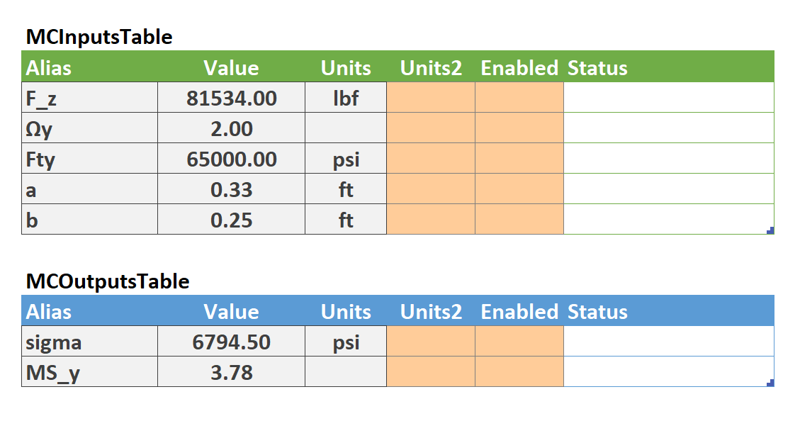
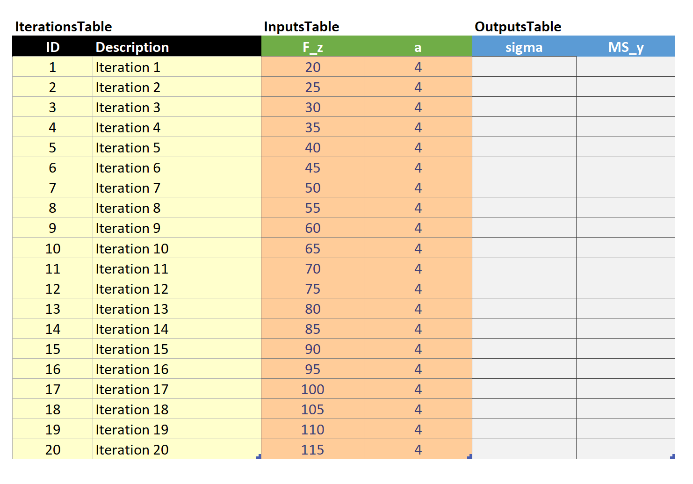
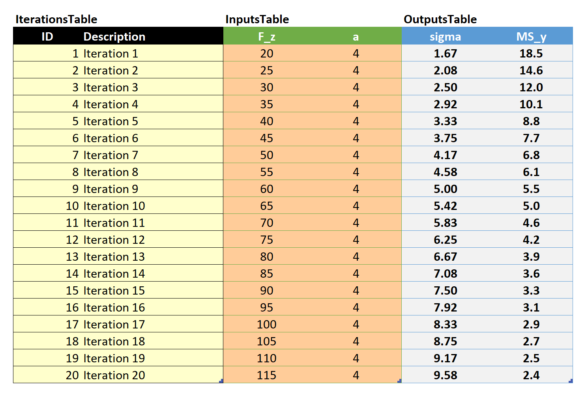

# Mathcad Excel Tool
This Excel template provides some basic automation tools for Mathcad Prime, and does not require any additional programming or installation from the user.

## Features
- Select a single Mathcad worksheet using a file selector dialog.
- Automatically read inputs, outputs, and default units for a Mathcad worksheet.
- Loop through as many iterations, inputs, and outputs as are supported by Mathcad.
- Override input and outputs units.
- Mathcad Worksheets are never saved. Future releases may allow for you to save the Mathcad worksheet with a specified iteration.

## Limitations
 - Ensure correct spelling of variable aliases.
 - Ensure correct Mathcad units syntax
 - Do **not** duplicate tables or tabs. The entire Excel document should be duplicated at the file level. This will change in future releases.
 - Do **not** rename tables. However, because tables are used, the template is less sensitive to format changes. For example, you can move a table and it will still work so long as the table name is hasn't changed.
 - It is recommended that you **close** Mathcad and all open worksheets prior to running scripts in this tool.

## Requirements
- Mathcad Prime 3.1 or later installed
- Excel

## Quick start
1. Setup the Mathcad worksheet of interest per [[mathcad#Designate inputs and outputs]]. The file `Example Worksheet.mcdx` bundled with the release shows what an alias list might look like.
2. Open the template.
3. Click **Select Mathcad Worksheet** and browse for the file.
4. Click **Read Mathcad Worksheet**.
5. Configure `MCInputsTable` and `MCOutputsTable` per [[#Tables]]. 
6. Rename and create columns in `InputsTable` and `OutputsTable` for each enabled row in `MCInputsTable` and `MCOutputsTable` respectively.
7. Add input values in `InputsTable` for each alias and iteration.
8. Click **Iterate** to begin iterating. Outputs will populate the `OutputsTable`. This operation could take a while.

## Interface
### Buttons
- **Select Mathcad Worksheet** - Opens a file dialog to select the location of the Mathcad worksheet. Network drives are allowable, but may not be as fast as local.
- **Read Mathcad Worksheet** - Reads the selected worksheet file for inputs and outputs, then populates the inputs and outputs table with default units and initial values.
- **Iterate** - Runs all iterations in the iteration table.
- **Clear Outputs** - Clears the values in the outputs columns in the iteration table.
- **Reset** - Clears all tables and the Mathcad worksheet path.

### Tables
All tables in this template are true structured tables. I highly recommend using right-click operations on tables in order to change their size.
- `MCInputsTable`/`MCOutputsTable` - Show the inputs and outputs defined in the Mathcad worksheet after running `Read Mathcad Worksheet`. Allows for some granular control.
	- `Alias` - Name of variable define in Mathcad.
	- `Value` - Existing value of the variable in the worksheet.
	- `Units` - Units of the default value.
	- `Units2` - Units of the column in the iteration table.
	- `Enabled` - `0` or `EMPTY` for disabled, `1` for enabled. Boolean value to enable the column in the iteration table. Disabled inputs will use the default value and units listed for that input. Rows that are enabled must have a corresponding column of the same alias in `InputsTable` and `OutputsTable`.
	- `Status` - Displays error messages. They appear in the order below, as only one is shown at a time.
		- *MISSING COLUMN* - Shows if an enabled input/output is missing a column in `InputsTable` or `OutputsTable`, respectively.
		- *MISSING UNITS* - Shows if an enabled column is missing a value in `Units2`. The default units cannot be used if the row is enabled, but they can be manually copied over.
- `IterationsTable` - Where you store information about each iteration. The ID and Description are for your information only. They do not influence calculations, and additional columns may be added to your liking.
- `InputsTable` - Where input data is stored for each iteration. You may include more columns than there are inputs/outputs designated in the Mathcad worksheet, since the `MCInputsTable` and `MCOutputsTable` control which are enabled.

## Tutorial
This tutorial walks you through an example Mathcad worksheet bundled with the release download. Begin by opening the downloaded Excel file.

1. Open `Mathcad Iterator.xlsm`.
2. You may need to click **Enable Content** in order to trust this document.
   
3. An additional dialog may pop up if you opened the file from a cloud location. This allows the VBA scripts inside the spreadsheet to run. If this did not occur, proceed.
   
4. Click **Select Mathcad Worksheet** and browse to `Example Worksheet.mcdx`, which comes bundled with the release. **Double click** on the worksheet or **single click**, and then click **Open**.
5. Click **Read Mathcad Worksheet**. An additional dialog will ask to confirm that you would like to clear `MCInputsTable` and `MCOutputsTable`. `InputsTable` and `OutputsTable` will remain as-is.
6. You should see the below data now populated inside `MCInputsTable` and `MCOutputsTable`. This shows all of the designated inputs and outputs of the worksheet, their current value, and units. Note that `MS_y` is unitless.
	      
7. Fill in the tables with the following data.
   
8. The `InputsTable` has been prepopulated with `20` iterations of values for `F_z` and `a`.
   
9. Click **Iterate** to begin the loop. Outputs should begin appearing in `OutputsTable`.
   
 
### Feature Pipeline
- [ ] Automatically build tables based on pre-defined Mathcad inputs and outputs
- [x] Clear outputs button
- [ ] Try/Catch all API calls
- [ ] Data validation
- [ ] Allow for tab duplication
- [ ] Matrix support
